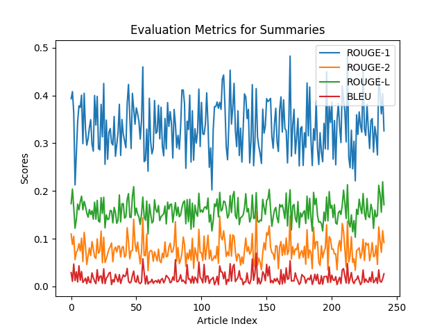
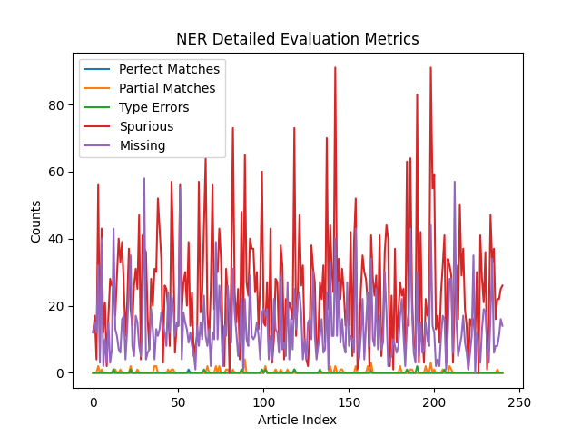

# Evaluating Scientific Paper Summarization Methods Using Multiple Metrics

## 📌 Authors
**Neaga Matei, Cordos Cristian, Ciobanu Alexandru**  
University POLITEHNICA of Bucharest  
Emails: mateineaga@outlook.com, icordos@gmail.com, alexandru.ciobanu98@stud.trans.upb.ro

## 📖 Abstract
This project evaluates **Transformer-based models** for scientific paper summarization, specifically focusing on **PEGASUS-XSum**. The study utilizes domain-specific datasets (**eLife** and **PLOS**) to generate abstractive summaries and evaluates their quality using **ROUGE, BLEU, and Named Entity Recognition (NER)** metrics. A **sliding window segmentation** approach is used to overcome input size limitations, and multiple preprocessing techniques are applied.

---

## 📌 Table of Contents
1. [Introduction](#introduction)  
2. [Related Work](#related-work)  
3. [Method and Experiment Details](#method-and-experiment-details)  
   - Preprocessing  
   - Summarization Pipeline  
   - Model Architecture  
   - Training and Fine-Tuning  
   - Evaluation Process  
   - Reinforcement Learning with Human Feedback (RLHF)  
4. [Results](#results)  
   - Quantitative Metrics  
   - Named Entity Recognition (NER) Analysis  
   - Fine-Tuning  
   - Performance Evaluation  
5. [Conclusion](#conclusion)  
6. [References](#references)  

---

## 1️⃣ Introduction
The rapid increase in scientific publications creates challenges in efficiently extracting relevant information. Traditional abstracts provide limited insights, and manual summarization is time-consuming. **Transformer-based models** such as **PEGASUS, BART, and BigBird** have significantly improved text summarization tasks. However, **long-form scientific articles** remain difficult to summarize due to structural complexity, domain-specific terminology, and model input limitations.

This study assesses the performance of **PEGASUS-XSum** on domain-specific datasets and implements **sliding window preprocessing** to handle long-text inputs effectively.

---

## 2️⃣ Related Work
### 🔍 State of the Art
- **PEGASUS:** Utilizes gap-sentence masking for abstractive summarization.  
- **BART:** A denoising autoencoder model for text reconstruction.  
- **BigBird:** Optimized for processing long-form documents with sparse attention mechanisms.

### 📊 Evaluation Metrics
- **ROUGE (Recall-Oriented Understudy for Gisting Evaluation):** Measures n-gram overlap between reference and generated summaries.
- **BLEU (Bilingual Evaluation Understudy):** Evaluates n-gram precision.
- **Named Entity Recognition (NER):** Tracks entity preservation in summaries.

### 📂 Datasets
- **eLife & PLOS:** Contain structured scientific articles with reference summaries, allowing for effective evaluation of summarization models.

---

## 3️⃣ Method and Experiment Details

### 🛠️ Preprocessing
- **Text Cleaning:** Retained only essential components (article body, sections, reference summary).
- **Sliding Window Segmentation:**
  - **Window Size:** 280 tokens  
  - **Step Size:** 100 tokens (overlapping to preserve context)  
- **Tokenization:** Used **PEGASUS tokenizer** to prepare text inputs.
- **JSON Formatting:** Saved preprocessed data for structured storage and compatibility with PEGASUS.

### 🚀 Summarization Pipeline
1. Tokenize input text.  
2. Generate summaries using **PEGASUS-XSum** with **beam search**.  
3. Concatenate window summaries into a final document summary.

### 🔬 Model Architecture
- **Pre-trained PEGASUS-XSum model.**
- **Fine-tuned on domain-specific scientific datasets.**
- **Beam Search Optimization** for improved fluency and coherence.

### 🎯 Training and Fine-Tuning
- **Optimizer:** AdamW with a learning rate of **5×10⁻⁵**.
- **Batch Size:** 4, trained over **6 epochs**.
- **Checkpoints:** Implemented to prevent loss of training progress.
- **Fine-Tuning Challenges:**
  - High memory usage for long-form text processing.
  - Need for dataset-specific optimization.

### 📈 Evaluation Process
- **ROUGE-1, ROUGE-2, ROUGE-L** (n-gram-based evaluation).
- **BLEU Score** (precision-based evaluation).
- **Named Entity Recognition (NER)** to measure entity retention.

### 🤖 Reinforcement Learning with Human Feedback (RLHF)
- **Supervised Fine-Tuning:** Used PEGASUS model pre-trained on **XSum dataset**.
- **Reward Model Training:**
  - Manual ranking of summaries (long format vs. short format).
  - Higher **ROUGE scores** indicate better summary quality.
- **Fine-Tuning with Proximal Policy Optimization (PPO):** Optimized model output based on **reward model evaluations**.

---

## 4️⃣ Results

### 📊 Quantitative Metrics
| Metric    | Average Score |
|-----------|--------------|
| **ROUGE-1** | 0.42 |
| **ROUGE-2** | 0.25 |
| **ROUGE-L** | 0.30 |
| **BLEU**    | 0.22 |

🔹 **Observations:**
- **ROUGE-1:** Captures **key unigrams** effectively.
- **ROUGE-2 & ROUGE-L:** Struggles with **coherence and sequence-level relationships**.
- **BLEU:** Moderate accuracy but challenges in maintaining linguistic precision for **long scientific texts**.

### 🔍 Named Entity Recognition (NER) Analysis
| Metric | Value |
|--------|-------|
| **Entity Overlap** | 67% |
| **Perfect Matches** | 2 per article |
| **Spurious Entities** | 10 per article (hallucinations) |
| **Missing Entities** | 8 per article |

🔹 **Observations:**
- Model retains **67%** of named entities from reference summaries.
- **High hallucination rate** suggests model generates **incorrect entities**.

### 🔧 Fine-Tuning Results
| Experiment | Learning Rate | ROUGE-1 | BLEU |
|------------|--------------|---------|------|
| #2 (Best) | **0.0001** | **0.043** | **0.005** |

🔹 **Observations:**
- **Lower learning rates** improved accuracy.
- Fine-tuned model struggled with **BLEU score** due to text complexity.

### 📉 Performance Evaluation
- PEGASUS-XSum **captures unigrams well** but struggles with longer dependencies.
- Model **needs improvements** in **coherence and entity retention**.

---

## 5️⃣ Conclusion
This study successfully evaluated **Transformer-based summarization models** for **scientific literature**. The findings suggest:

✅ **PEGASUS-XSum is effective for abstractive summarization** but struggles with **long-form scientific texts**.  
✅ **Sliding window segmentation** helps accommodate model input limits.  
✅ **Named Entity Recognition analysis** highlights model limitations in domain-specific terminology retention.  
✅ **Fine-tuning and RLHF improve summarization quality**, but require **dataset-specific optimization**.

---

## 6️⃣ References
📌 For full references, please see the [Full PDF Document](https://github.com/mateineaga/Evaluating_scientific_paper_summarization_methods_using_multiple_metrics.pdf).

---

